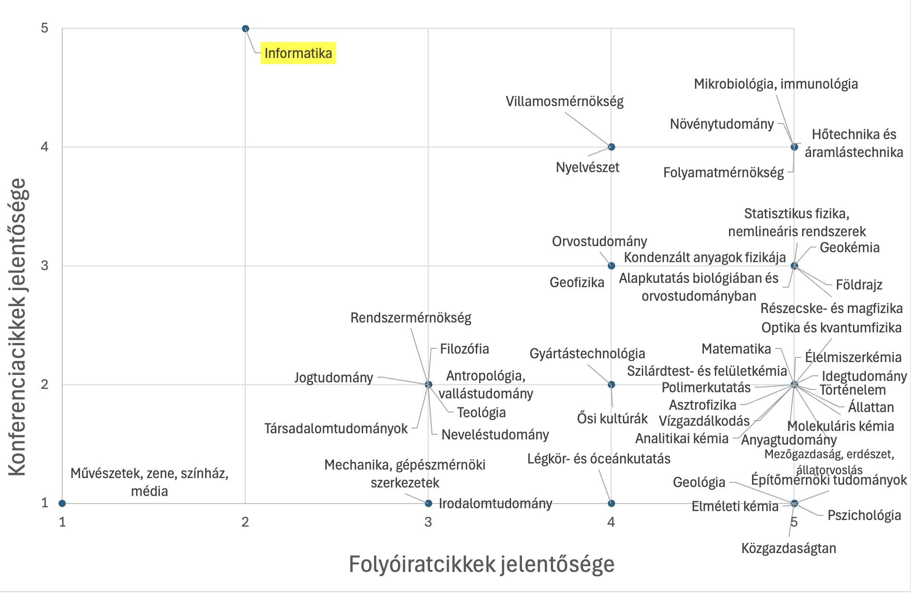
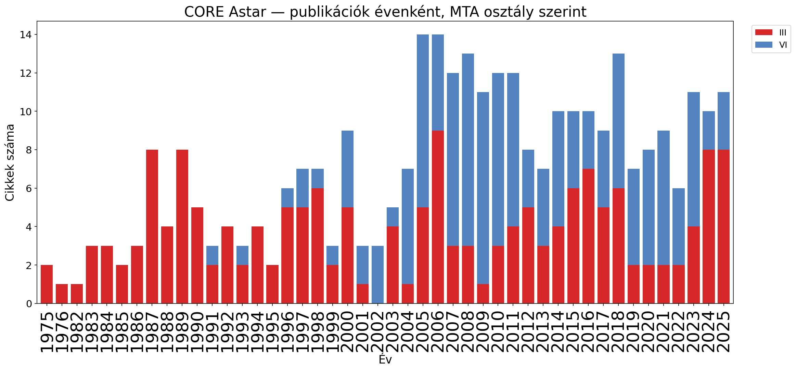
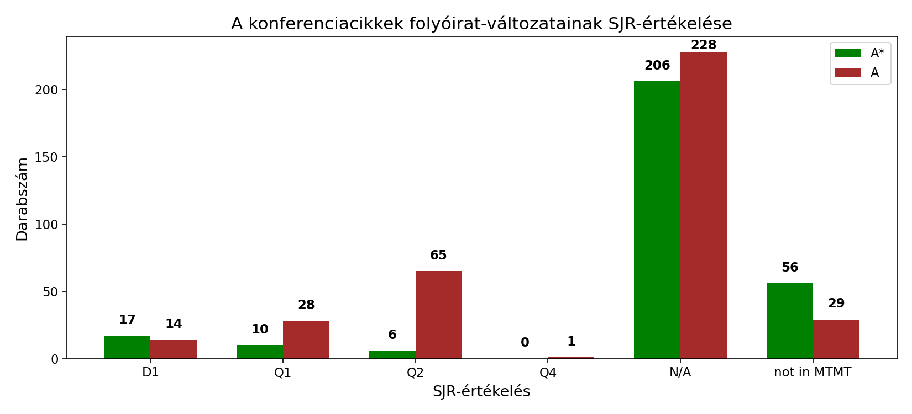

# A CORE konferenciarangsor szerepe és tanulságai a hazai informatikai kutatás szempontjából

Az informatikai tudományterületen a publikálási kultúra jelentősen eltér más tudományágakétől. A következő ábra a folyóiratok és a konferenciák relatív fontosságát mutatja a Német Kutatási Alap (DFG) 48 szakterületének szakmai zsűrijeinek értékelése alapján [forrás: DFG, Academic Publishing as a Foundation and Area of Leverage for Research Assessment, 2022](https://www.dfg.de/resource/blob/175776/positionspapier-publikationswesen-en.pdf).

Míg a legtöbb tudományterületen a meghatározó eredmények folyóiratokban jelennek meg, addig az informatika lényegében egyedüliként inkább a konferenciákat részesíti előnyben. Ezek a kiemelt konferenciák nem átlagos rendezvények: a cikkek bírálati folyamata rendkívül szigorú és hangsúlyos. A bírálatok jellemzően többkörösek, és az egyes körök között a bírálók szakmai vitát folytatnak online felületeken. A többkörös folyamat végére egy elfogadott cikk akár hat bírálatot is kaphat.

A folyóiratokhoz hasonlóan általában van lehetőség a szerzők számára, hogy reagáljanak a bírálatokra – ezt rebuttal-nak hívják. Az elfogadás előtt gyakran sor kerül egy ún. shepherding szakaszra is, ami a folyóiratok minor revision fázisának felel meg. A bírálók olykor annyira magabiztosak a döntésükben, hogy az elfogadott cikkek bírálatait nyilvánosságra is hozzák.

Az informatikában a konferenciák népszerűségét részben a szigorúan ütemezett bírálati folyamat, illetve a néhány hónapon belül garantált döntés magyarázza, részben pedig az, hogy az ipari és innovációs szféra szereplői ritkán olvasnak folyóiratcikkeket, viszont szívesen részt vesznek konferenciákon, ahol előadás formájában hallhatnak a legújabb, áttörő eredményekről.

Ez abból is jól látszik, hogy a nagy informatikai vállalatok jelentős összegeket fordítanak ezeknek az eseményeknek a támogatására. Másfelől a kutatók is versenyeznek az innovációs szféra figyelméért, és egy rangos konferencián való megjelenés jelentősen növeli egy eredmény láthatóságát.

Ennek hatására mára olyan konferenciák alakultak ki, amelyek újdonságtartalmukban és presztízsükben is meghaladják a vezető folyóiratokat az infromatika területén.

A konferenciák versenyében segít eligazodni a CORE konferenciarangsor. A CORE lista 2006 óta létezik, az Ausztrál Tudományos Akadémia és szakmai grémiumok közreműködésével. A minősítési rendszer négy fő kategóriát különböztet meg (A*, A, B, C), és néhány évente frissítik. A rangsorolás középpontjában a következetes lektorálási folyamat, a reputáció, a történeti hivatkozottság, a közösség bevonódása és a konferenciák szakmai presztízse áll.

A legmagasabb, A* kategóriába tartozó konferenciák szelekciós aránya a vezető folyóiratok szintjén van (megközelíti a D1-es besorolású lapokat, illetve a norvég lista 2-es szintjét). Ezeken a fórumokon a benyújtott cikkek többségét – gyakran 80–90%-át – elutasítják.

Egyes A* konferenciák esetében a főszöveg terjedelme kilenc oldal, amelyhez tetszőlegesen hosszú függelék csatolható, így terjedelmileg és minőségileg is megfelelhet akár egy D1-es folyóiratnak.

A világ vezető kutatóegyetemei – például az MIT, a Stanford, a Berkeley, a Cambridge, az EPFL és a Tsinghua – elsősorban ezeken a konferenciákon publikálnak.

Egy CORE A*-os cikk elfogadásához sokszor némi szerencse is kell: az eredménynek éppen abban az évben kell áttörésnek számítania, amit nehéz előre megtervezni. Még a leghíresebb kutatók számára is kihívás bejutni egy A* konferenciára.

Ugyanakkor egy A* konferencia programbizottságában való részvétel tudományos elismerésnek számít, ám jelentős terheléssel jár: a tagoknak évente akár 12–14 cikket is bírálniuk kell, szigorú határidők mellett, részletes értékelésekkel és szakmai vitákkal kiegészítve.

A CORE A kategória szintén nagyon magas minőséget képvisel; ebből lényegesen több van, és az áttörő eredmény itt kevésbé elvárás. Más tudományterületeken a Q1-es folyóiratok jelentik a hasonló szintet.

A CORE B kategória még mindig minőségi publikációnak számít, nagyjából a Q2-es folyóiratoknak feleltethető meg. Kétes minőségűnek azokat a konferenciákat tekintik, amelyeket a CORE nem rangsorol – ezek a norvég lista 0-s szintjének vagy a Q4-es folyóiratoknak feleltethetők meg.

Megjegyzendő, hogy a konferencia-orientált tudományterületeken a folyóiratok nehezebb helyzetben vannak a bírálók toborzása miatt, ezért ezeken a szakterületeken a D1, Q1, Q2 stb. kategóriák határai némileg eltolódnak.

A minőségi konferenciacikkek megítélése a hazai tudománymetriában sokszor félrecsúszik. A folyóiratcentrikus szemlélet nem tükrözi a nemzetközi informatikai gyakorlatot, ezért előfordul, hogy egy A* konferencián publikált, komoly munkával elkészült cikk nem kap megfelelő elismerést.

Ezen cikkek elismerése Magyarországon jelenleg eseti: tudomásunk szerint két doktori iskola (az SZTE Informatikai és a BME Matematikai Doktori Iskola) értékeli azokat a folyóiratcikkekkel egyenrangúan. A III. (Matematikai) Osztály doktori követelményei között a 30 kiemelt hivatkozás esetében megengedett a rangos konferenciapublikáció beszámítása az informatika és számítástudomány területén, ahol ezt a CORE A és A* konferenciarangsor alapján definiálják.

Az MTMT-ben a rangos konferenciák jelenleg nincsenek külön megjelölve, bár az MTMT3 fejlesztése során ez a funkció várhatóan megjelenik. A magyar informatikus kutatók így elsősorban a saját szakterületük konferenciáit követhetik nyomon, ám eddig nem állt rendelkezésre átfogó kép a hazai teljesítményről. Ezt a hiányt pótolandó összegyűjtöttük a magyar kutatók CORE A* és A kategóriás konferenciacikkeit.

## Magyar jelenlét a CORE A* és A konferenciákon

Ebben a tanulmányban a magyar jelenlétet elemezzük a CORE A* és A konferenciákon. A hazai kutatók publikációit automatikus adatgyűjtés alapján (DBLP és MTMT összekapcsolásával, ~700 szerző adataival) kezdtük feltérképezni. Egy cikket akkor számolunk magyar kötődésűnek, ha legalább egy szerzője magyar affiliációt tüntet fel a cikken. Fontos kiemelni, hogy a CORE szerinti besorolásnál csak a konferencia fő track-jén megjelent cikkeket vizsgáljuk, mert a kísérő események (workshopok, poszter- és demo-szekciók, doktoranduszi programok) közti különbség meghatározó. Sok szerző hajlamos workshop-, demo- vagy poszteranyagot is „fő-konferenciacikként” feltüntetni, ezért szükséges volt kézzel leválogatni a cikket. A válogatás némi szakmai ismeretet is igényel. Például a poszter nem mindig jelent szatellit eseményt: egyes A*-os konferenciákon (például az ICSE esetében) a több ezer résztvevő közül csak néhány tucat prezentálhat a fő szekcióban (main track), míg a többiek poszterként jelennek meg – pedig a cikkeik ugyanazon a szigorú bírálati folyamaton mentek keresztül.

A teljes lista itt található [Core A*](http://lendulet.tmit.bme.hu/lendulet_website/corea) és [A](http://lendulet.tmit.bme.hu/lendulet_website/corea-2). Összegezve a szűrés logikája:
	•	csak a fő konferenciákon (main track) megjelent cikkek kerültek be,
	•	a „szatelit” események (workshop, demo, poster, student track stb.) nem számítanak,
	•	csak akkor számított magyar megjelenésnek, ha legalább egy szerző magyar intézményi affiliációval szerepelt a publikációban,
	•	a cikkek MTMT-megjelenése is ellenőrzésre került, mivel sokszor hiányoznak vagy hibásan szerepelnek az adatok.

 Célunk annak feltárása volt, hogy mennyi és hol megjelenő minőségi magyar informatikai eredmény születik. A munkákat két kategóriába osztottuk elméleit (MTA III osztály) és gyakorlati (MTA VI osztály) informatika. Lent található két szófelhő a besorolásokról:

A konferenciákat e két kategóriába sorolva, 1975 óta a következő számú CORE A* és A konferenciacikket találtuk:

A cikkek száma nagyjából hasonló: valamivel több elméleti cikket találtunk a CORE A* szinten, és némileg több alkalmazott informatikai cikket a CORE A szinten. Az informatikai területen mind a D1, mind pedig a Q1 folyóiratcikkek száma 1975 óta bőven meghaladja ennek a tízszeresét magyar affiliációval.

Megvizsgáltuk a cikkek időbeli eloszlását is. Bár a CORE-lista csak 2006 óta létezik, az évek során viszonylag keveset változott, ezért a 2006 előtti időszak esetében a 2006-os listát vettük alapul.

Jól látszik, hogy az elméleti informatikai konferenciákon a magyar jelenlét lényegesen korábban, már az 1980-as és 1990-es években megjelent, míg a gyakorlati irányultságú konferenciákon csak a kétezres évektől kezdve találkozunk magyar kutatókkal.
Pontosabban: a CORE A szinten már a kilencvenes évektől is megfigyelhető volt aktivitás. A területek fejlődése is jól kirajzolódik: először a CORE A szinten jelentek meg a magyar cikkek, majd idővel a CORE A* konferenciákon is.

Megvizsgáltuk továbbá, hogy hány különböző konferencián jelent már meg magyar kutató. Lényegesen kevesebb elméleti jellegű CORE A* és A konferenciát azonosítottunk, ezek többségén azonban már szerepeltek magyar kutatók.
Mivel összességében is jóval kevesebb CORE A* konferencia létezik, mint CORE A, ez magyarázza a viszonylag magasabb lefedettséget a CORE A* kategóriában.
Az alkalmazott informatikai konferenciák esetében ugyanakkor még számos olyan rendezvény van, ahol eddig nem sikerült magyar kutatónak publikálnia. 

## A magyar informatikus kutatók kihívásai

A publikációs stratégia szempontjából komoly dilemmát jelent a hazai fiatal kutatók számára, hogy a magyar minősítési rendszer lényegében csak a folyóiratcikkeket díjazza, míg a nemzetközi informatikai közeg a konferenciapublikációkat értékeli nagyobbra. Így karrierjük elején döntés elé kényszerülnek: ha Magyarországon szeretnének érvényesülni, akkor a doktori fokozat megszerzése és a későbbi sikeres pályázatok érdekében a folyóiratpublikációk számának növelése a cél. Ha viszont nemzetközi informatikai pályát kívánnak építeni, akkor elsődleges céljuk, hogy legyen CORE A* (vagy A) konferenciacikk publikációjuk, és lehetőleg első szerzőként.

Megjegyezzük, hogy például a Technion Egyetemen a doktori védésnek publikációs szempontból az egyetlen feltétele, hogy a jelölt első szerzőként publikáljon egy CORE A*-os konferenciacikket.

Gyűjtöttünk adatokat a fenti dilemmával kapcsolatban: azt vizsgáltuk, hogy azok a kutatók, akik aktívan publikálnak CORE A és A* szintű konferenciákon, milyen arányban választanak külföldi kutatói karriert.

Első lépésként azt elemeztük, hogy a kutatók mikor frissítették utoljára az MTMT-profiljukat. Ha ez kevesebb mint három éve történt, akkor feltételeztük, hogy továbbra is aktívak a magyarországi kutatói közösségben. Emellett egyenként megvizsgáltuk a kutatók honlapját, hogy feltüntetik-e rajta külföldi egyetemi affiliációjukat, illetve LinkedIn-profiljuk alapján hazai vagy nemzetközi ipari munkahelyen dolgoznak-e.

A következő tortadiagramokban a sötét szín azokat a kutatókat jelöli, akik Magyarországon élnek és aktívak a hazai kutatói közösségben. A világosabb szín azokat, akik elhagyták a kutatói pályát, és egy magyarországi vállalatnál helyezkedtek el – így már nem vesznek részt a tudományos életben. A doktori képzés egyik alapvető célja, hogy magasan kvalifikált munkaerőt biztosítson a magyar ipar számára. 

A harmadik kategóriába azok a kutatók tartoznak, akik külföldön dolgoznak – akár egyetemen, akár ipari kutatóintézetben. Ők a magyar tudomány szempontjából inkább veszteségként értelmezhetők, hiszen tudásuk és tapasztalatuk már nem a hazai kutatói közösséget gyarapítja.

Továbbá négy szintre osztottuk a kutatókat az eddigi aktivitásuk alapján a CORE A* és A szintű konferenciákon. Minden szerzőt csak egy, a legmagasabb elért szintnek megfelelő kategóriába soroltunk. Mind a négy szintet a CORE A* és A publikációk száma alapján definiáltuk. A számításnál A*-**ekvivalens publikáció** alatt azt értjük, hogy három CORE A cikk egy CORE A* publikációval egyenértékűnek számít. A 3-as szorzó alkalmazását az indokolja, hogy a CORE rangsor alapján hozzávetőlegesen háromszor annyi CORE A szintű konferencia létezik, mint CORE A*.

A kategóriák a következők:

Established
: Azok a kutatók, akik legalább egy CORE A* konferencián első szerzőként publikáltak, és összesen több mint 10 CORE A*-ekvivalens publikációjuk van, ami nemzetközi szinten is kiemelkedő teljesítményre utal.

Expert
: Olyan kutatók, akiknek összesen legalább 5 CORE A*-ekvivalens publikációjuk van, ami erős és tartós nemzetközi jelenlétet jelez.

Rising
: Azok a kutatók, akiknek legalább 2,5 CORE A*-ekvivalens publikációjuk van, akik elsősorban hazai szinten aktív és elismert kutatók, vagy fiatal kutatók feltörekvő nemzetközi aktivitással.

Entry
: Kutatók, akiknek legfeljebb 1 CORE A*-ekvivalens publikációjuk van, és akik már elérték a nemzetközi publikációs szintet. 

Egy CORE A*-os konferenciacikkel már jó eséllyel lehet külföldön kutatói állást szerezni, míg öt ilyen publikációval szinte bármely vezető egyetemen vagy kutatóintézetben szívesen alkalmazzák az illetőt.

A diagramokból az olvasható ki, hogy az elméleti informatika területén a kutatókat nagyobb arányban sikerül megtartani a hazai tudományos közösségben. Ez részben azzal magyarázható, hogy az elméleti informatikai kutatás korábban érte el a CORE A* szintet, mint az alkalmazott informatika, így a hazai támogatási és értékelési rendszereknek több idejük volt hozzá igazodni.

Lényegesen kevesebb elméleti kutató helyezkedett el magyarországi vállalatoknál, főként a Morgan Stanley-nél. Egy teljes kutatói generáció hagyta el az akadémiai pályát, amikor a Google megnyitotta a magyarországi kutatóközpontját, azonban ők ma már jellemzően külföldön dolgoznak.

Az alkalmazott kutatók elsősorban az Ericssonhoz, illetve kisebb magyar startupokhoz mentek el dolgozni. Megjegyezzük, hogy az alkalmazott kutatások jellemzően nagyobb kutatócsoportokat igényelnek, ezért ezekben a publikációkban általában több szerző vesz részt, ami a statisztikai arányokat is befolyásolhatja.

Az Established és Expert kategóriákban több mint kétszer annyi elméleti kutatót találtunk, mint alkalmazottat, míg a Rising és Entry szinteken éppen fordított a helyzet: ott közel kétszer annyi alkalmazott informatikus kutató szerepel, mint elméleti.

Ezt az arányt egy külön ábrán is bemutatjuk, ahol a vízszintes tengely a kutatók által elért CORE A-ekvivalens publikációk számát*, míg a függőleges tengely az adott szinten lévő magyar szerzők számát mutatja.

Az ábrán jól megfigyelhető, hogy az elméleti kutatóknál a görbének jellegzetes „hasa” van 3 és 9 közötti publikációszámnál. Ez a jelenség vélhetően annak köszönhető, hogy az elméleti informatika területén jobban sikerül itthon tartani a fiatal kutatókat, illetve annak is, hogy az elméleti informatikai publikálásnak Magyarországon régebbi és erősebb hagyománya van a nemzetközi konferenciákon. Már 3 CORE A* konferenciacikkel is nagyon jó külföldi kutatói állások érhetők el, mivel nagy a kereslet az ilyen teljesítményű kutatók iránt a vezető nemzetközi egyetemeken és kutatóintézetekben.

A két görbe lecsengése közötti különbség abból is adódik, hogy az elméleti jellegű cikkeknek általában kevesebb szerzője van, mint az alkalmazott kutatásoknak. Intuíciónk ellenőrzésére — miszerint a magyar tudományos közéletből sok alkalmazott informatikai cikk hiányzik — elkészítettünk egy tortadiagramot azokból a publikációkból, amelyek a fentebb vizsgált magyar szerzőktől származnak, de már csak külföldi affiliáció szerepelt rajtuk. 

Az elméleti informatikában is jelentős a külföldre vándorlás, de az alkalmazott informatikában ezeknél a szerzőknél kétszer annyi cikk született, jellemzően olyan környezetben, ahol a kutatókat kifejezetten motiválják a top konferenciás publikációkra. Az is megfigyelhető, hogy a CORE A konferenciák kevésbé vannak a célkeresztben külföldön.

Mindez jól mutatja, mekkora potenciál rejlik az alkalmazott kutatási területek kutatói utánpótlásának megerősítésében.

## Informatika hatása a tudományra

Bár első látásra a probléma egy szűk szakterületet – az informatikát – érinti, ma már szinte minden kutatásnak van informatikai vonatkozása.

Például az Excel-táblázat hasznos eszköz az adatok összesítésére, ha világosan látszik, hogyan szeretnék az adatokat később felhasználni. Kutatások esetén azonban az adatgyűjtés fázisában ez jellemzően még nem egyértelmű, és több lehetséges kimenetel sem zárható ki. Ilyenkor minden új kutatási ötlethez új Excel-táblázatot kellene készíteni.

Megfelelő informatikai háttér esetén az adatokat olyan adatkezelő szoftverekben gyűjtik, amelyek komplex műveletekre is alkalmasak. Ez megadja a kutatói szabadságot azáltal, hogy lehetőséget teremt bonyolult lekérdezések és elemzések elvégzésére. 

Egy másik terület, ahol az informatika élen jár, az a csapatmunka támogatása. Az informatikai rendszerek kifinomult eszköztárral rendelkeznek a közös munkavégzés megkönnyítésére. Egy szoftverben az egyes funkcióknak rendkívül precízen kell együttműködniük — sokkal precízebben, mint ahogy az a kutatási folyamatokban általában megszokott.

Több kutató párhuzamosan dolgozhat ugyanazon adathalmazon vagy modellen, miközben az egyes változtatások nem vesznek el, hanem kontrolláltan integrálhatók. Ezt teszi lehetővé a verziókövetés, amely az adatok, programkódok vagy elemzési eredmények időbeli változásait követi nyomon. Segítségével minden módosítás visszakereshető, dokumentálható, és szükség esetén visszaállítható a korábbi állapot. A kutatási adatok esetében ez különösen fontos, mert biztosítja az átláthatóságot, reprodukálhatóságot és hitelességet.

Ennek köszönhetően a mérések elemzésekor könnyebben azonosíthatók a hibás adatok, és ha az elemzés teljesen automatizált, akkor a hibás adat kijavítása után a hozzá tartozó diagramok és táblázatok is automatikusan frissülnek. Például az ebben a dokumentumban szereplő ábrák mind automatikusan frissülnek, ahogy újabb és újabb magyar cikkek jelennek meg.  

Másik példa, amikor az adatokon bonyolultabb számításokat kell végezni, és a kutatók ehhez saját szoftvert fejlesztenek. Ezekre a szoftverekre jellemző, hogy a fejlesztés során többször is változnak az igények. Könnyen módosítható szoftver készítése azonban lényegesen magasabb szintű informatikai tudást igényel, mint a hagyományos, specifikáció alapú fejlesztés. A cél az, hogy a szoftver objektumstruktúrája jól tükrözze a vizsgált probléma sajátosságait. Ehhez egyszerre kell érteni a kutatott témához és az agilis fejlesztési módszertanhoz. Nem véletlen, hogy a szoftverfejlesztés során teljesen természetes, ha a programot időről időre lényegében a nulláról újraírják — csak így biztosítható a magas minőség.

Ezek a szoftverek általában több fejlesztő közös munkájának eredményei. Jelentős előnyt jelent, ha a kutatók ismerik azokat az informatikai eszközöket, amelyeket a közös fejlesztések támogatására hoztak létre, és ezeken keresztül kommunikálnak a fejlesztőkkel. Sőt, célszerű ezeken keresztül nemzetközi szoftverfejlesztési projektekbe is bekapcsolódni. A kapcsolódó munkák feltérképezése és megértése a szoftverfejlesztés jelentős részét teszi ki, de csak így kerülhető el, hogy „újra feltalálják a spanyolviaszt.”

Gyakran az informatikai kutató hiányára utal az is, ha a problémát megoldó szoftver kivárhatatlanul sokáig fut. Ilyen esetekben gyakori, hogy a számítás egyetlen modul miatt akad el. Előfordul, hogy a szűk keresztmetszetet jelentő modul jól párhuzamosítható, és megfelelő elosztott számítási kapacitással – például GPU-k alkalmazásával – jelentősen felgyorsítható. Tipikus példa az elakadásra, amikor egy lassú modul főként olyan részleteket számol ki, amelyekre valójában nincs is szükség ilyen mélységben. Ilyenkor az informatikus kutatónak mélyebben meg kell értenie a számítás menetét, és szükség esetén módosítani kell a számítás menetét.

A modern számítógépek elképesztő számítási kapacitással rendelkeznek, ezért nagyon ritka, hogy egy kutató valóban olyan feladatot próbáljon megoldani, amely technikailag megoldhatatlan. Sokkal gyakoribb, hogy a probléma valójában egy másik, jobban megtervezett számítási módszerrel – esetleg némi kompromisszummal – hatékonyan kezelhető lenne. Az ilyen alternatív megoldások megtalálása azonban már messze túlmutat egy hagyományos fejlesztő feladatkörén, és informatikai kutatói szemléletet igényel.

Az elméleti kutatások célja elsősorban új informatikai eszközök és módszerek kidolgozása, vagyis megoldást adni olyan problémákra, amelyeket korábban megoldhatatlannak gondoltak. Bár ezek hatása gyakran széles körű, konkrét alkalmazásokban is áttörést hozhatnak. A magyar elméleti informatika hosszabb múltra tekint vissza, és nemzetközi szinten is jelentős eredményeket ért el, amit az ERC-díjak is jól mutatnak.

Összegezve, a műszaki kutatások egyre nagyobb mértékben támaszkodnak az informatikára. A gépi tanulás berobbanásával pedig ma már gyakorlatilag minden tudományterület egyre inkább függ az informatikai módszerektől – ahogyan azt az alábbi ábra is szemlélteti.

A fentiekhez párhuzamosan az informatikai kutatás folyamatosan keresi az új alkalmazási területeket. A következő ábrán a CORE A* konferenciák 2024-es felhívásaiból készített szófelhő látható, amely jól szemlélteti, milyen nagy hangsúlyt kapnak az alkalmazások.

Az Egyesült Államokban 2023-ban összesen 58 000 sikeres PhD-védés történt, ebből 2000 az informatika területén (konferenciaorientált tudományágakban), és további 2000 olyan területen, ahol a folyóirat-publikációk mellett a konferenciaelőadásoknak is fontos szerepük van [forrás: American Society for Engineering Education. (2024). Profiles of Engineering and Engineering Technology, 2023. Washington, DC.](https://ira.asee.org/by-the-numbers/)

Ezek a területek önmagukban is a tudomány jelentős részét képviselik, és az informatika térnyerésével várható, hogy az informatikai konferenciák szerepe minden tudományterületen tovább növekszik.

## Core A* konferenciák hatása az egyetemi rangsorokra

Végezetül megvizsgáltuk a CORE A* konferenciák hatását az egyetemi rangsorokra. Az egyetemi rangsorok pontszámai több tényezőből tevődnek össze. A CORE A* és A konferenciák hatása a publikációs indikátorokon keresztül minimális, mivel sok helyen a konferenciacikkeket egyáltalán nem számolják, és darabszámuk is elenyésző.

Úgy véljük azonban, hogy ezek hatása sokkal inkább az akadémiai reputáció mérőszámában tükröződik vissza. Ezt a mutatót szakértők rangsorolásai alapján számítják ki. Bár közvetlenül nem tudhatjuk, hogy egy szakértő miért rangsorol előrébb egy adott egyetemet, mint egy másikat, megvizsgáltuk, hogy az akadémiai reputáció korrelál-e a CORE A* konferenciákon való jelenléttel.

Ehhez letöltöttük a CORE A* konferenciák programjait, szöveges formátumba konvertáltuk őket, és megkerestük bennük az egyetemek neveit mint karakterláncokat. Az alábbi ábrán a vízszintes tengelyen az akadémiai reputáció mérőszáma, a függőleges tengelyen pedig az egyező sztringek száma látható. A korreláció eredménye meglepő — sőt, sokkoló.

## Core A* cikkek utóélete 

Jelenleg a kutatóknak gyakran „második körben” kell átdolgozniuk a már elfogadott konferenciacikkeiket folyóirat-változattá, csupán azért, hogy az itthoni rendszerben elismerést kapjanak — még akkor is, ha az eredeti konferencia rangosabb fórum. Ez az eljárás tehát egyfajta „dupla könyvelést” eredményez, ami felesleges munkát és torz ösztönzőket teremt.

A lenti ábrán azt vizsgáltuk, hogy hányszor szerepelt azonos névvel folyóirat-publikáció a konferenciapublikáció mellett, illetve amikor szerepelt, akkor az MTMT-ben milyen SJR-értékelést kapott.

Az ábra alapján legtöbbször nem adják be folyóiratba, vagy nem azonos névvel. Utóbbi esetben feltehetően a cikk tartalmát is bővítették. A CORE A* konferenciacikkek leggyakrabban D1-es folyóiratban jelennek meg. A CORE A konferenciacikkek is bekerülnek D1-es folyóiratokba, de ez kevésbé jellemző.

 
## Javaslatok a probléma enyhítésére

A probléma megoldását egyfelől az informatikai konferenciák elfogadásában és népszerűsítésében látjuk. Jelenleg sikerült összegyűjteni a magyar vonatkozású CORE A* és A kategóriás cikkeket. Eddig sajnos senkinek nem volt átfogó képe a helyzetről: a kutatók legfeljebb a saját szűk szakterületüket látták át. Hosszabb távon célunk a CORE B kategóriás cikkek összegyűjtése is, mivel ezek is tisztességes minőséget képviselnek.

A CORE a legelterjedtebb nemzetközi konferenciarangsor, de nem az egyetlen. Kínában több egyetem is közvetlen finanszírozási rendszert alkalmaz a CORE A* és A konferenciákon megjelent cikkekre, és ehhez elkészítették a saját rangsorukat. Ez a lista csak minimálisan tér el a CORE-besorolástól. Úgy gondoljuk, hogy a magyarországi informatikai kutatói közösség túl kicsi lenne egy saját rangsor kialakításához. Bár a CORE-listában valóban akad néhány vitatható besorolás, súlyos hibák nincsenek benne. Ráadásul egy ilyen lista folyamatos karbantartása jelentős anyagi és humán erőforrást igényelne.

A kínai rendszer bevezetése óta a kínai kutatók jelenléte feltűnően megnőtt a CORE A* és A konferenciákon, míg a B és C kategóriás konferenciákon továbbra is minimális. A közvetlen finanszírozás évek óta működik Kínában, és összességében azt látjuk, hogy a CORE-lista kiállta az idők próbáját. Nem tapasztalunk visszaéléseket: a kínai kutatók előretörése részben a rendelkezésükre álló jelentős erőforrásoknak, részben pedig annak köszönhető, hogy mára rendkívül magas szinten sajátították el a tudományos angol nyelvhasználatot.

Magyarországon a következő lépés az lenne, hogy csökkentsük a folyóirat-kényszert az informatikai kutatói közösségben — legyen szó az informatikai doktori iskolákról, a habilitációs és MTA-döntésekről, az alapítványi egyetemek teljesítménymutatóiról vagy a pályázati rendszerekről.

Az informatikai folyóiratcikkek értékelése egyébként is több szempontból problémás. Vannak példák arra, hogy egy kutató évente akár 100-nál is több folyóiratcikket publikál, ami erősen csökkenti a rendszerbe vetett bizalmat. Informatikában csak a legjobb folyóiratokban van valódi verseny, és ezekben is elsősorban azokkal az országokkal versenyzünk, ahol a folyóiratközpontú értékelés még domináns — jellemzően a fejlődő országokban.

A mesterséges intelligencia ma már képes ezekre a fórumokra is elegendően jó minőségű cikkeket generálni, pusztán néhány jól megfogalmazott utasítás alapján. Ez a mennyiségi publikálás korszakának végét fogja jelenteni – rövid időn belül, és nemcsak az informatikában, hanem más tudományterületeken is.

Hasznos lenne a támogatási rendszer újragondolása is. A fiatal kutatók számára finanszírozni kellene a részvételt a vezető konferenciákon (legalább a regisztrációs díjat és az utazási költséget), hogy bátran merjenek ezekre a konferenciákra cikket beadni. Sok esetben maga a bírálati folyamat is jelentős szakmai fejlődést hoz, még elutasítás esetén is. Ráadásul ezek a konferenciák komoly láthatósági értékkel bírnak a nemzetközi tudományos közösségben.

Végezetül javaslatunk lényege:
- a CORE A* konferenciacikkeket automatikusan lehessen D1 folyóiratcikkekkel,
- a CORE A konferenciacikkeket pedig Q1 folyóiratokkal egyenértékűnek tekinteni.

Ezáltal a magyar kutatók teljesítményét egységes, nemzetközileg elfogadott logika alapján lehetne értékelni, anélkül, hogy párhuzamos követelményeknek kellene megfelelniük.

## Összefoglalás

Az itthoni folyóirat-centrikus szemlélet figyelmen kívül hagyja, hogy az informatika számos alterületén a világ vezető kutatói eredményeiket nem folyóiratokban, hanem top konferenciákon publikálják. Ez a torzulás különösen a fiatal kutatókat érinti, akiknek dönteniük kell: követik-e a nemzetközi publikációs normákat és építik nemzetközi kapcsolatrendszerüket, vagy az itthoni minősítési logikához igazodva „folyóiratosítják” az eredményeiket. Ez utóbbi idő- és energiapazarlást jelent, miközben a nemzetközi láthatóságuk is csökkenhet.

Magyarországon jelen van a minőségi informatikai kutatás, ám a publikációs elvárások és a finanszírozási struktúrák nem támogatják kellően a nemzetközileg releváns fórumokon való részvételt. Ezért a publikációs és értékelési rendszernek tükröznie kellene ezt a valóságot.

Az informatika ma már nem elkülönült diszciplína, hanem szorosan átszövi a műszaki, természettudományos és alkalmazott kutatások egészét. Hosszabb távon a teljes hazai kutatási ökoszisztéma érdeke, hogy integrálódjon abba a gyakorlatba, amelyben az informatika főbb publikációs fórumai is szerepet kapnak.

A fiatal kutatók itthon tartása, a nemzetközi kiválósági fórumokon való rendszeres jelenlét, valamint a minőségi munka megfelelő elismerése az egész magyar tudományos közösség versenyképességét erősítené.

